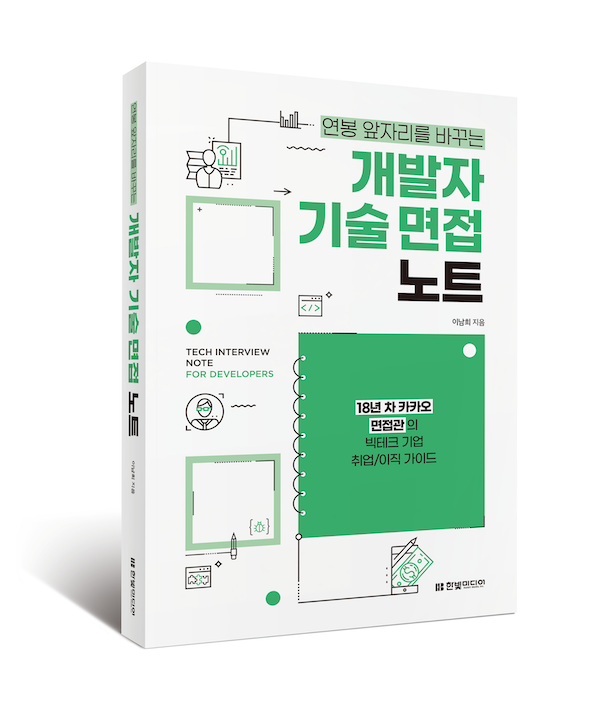

# Coding Guide for Java Programmer By 코드빌런 

> 본 내용은 한빛미디어에서 출간한 제 책(개발자 기술 면접 노트)의 일부 내용을 보강하기 위해서 만든 코딩 가이드 입니다.<br>
> 설명에서는 타이핑을 줄이기 위해서 존대를 생략했으니 양해 바랍니다.<br> 
> 만약 내용에 문제가 있거나 오/탈자가 있을 경우 villainscode@gmail.com으로 메일 부탁드립니다.
> - Instagram - [https://www.instagram.com/codevillains](https://www.instagram.com/codevillains)
> - email - [villainscode@gmail.com](mailto:villainscode@gmail.com)
> - Yes24 - https://www.yes24.com/Product/Goods/125554439
> - KyoboBooks - https://product.kyobobook.co.kr/detail/S000212738756


# 📖 코딩 가이드 

## 들어가기에 앞서 
이 내용은 아래의 서적과 링크를 참고하여 작성하였다. 각종 예제 코드들은 개인 코드를 포함하여 챗GPT의 도움을 받았다.

## 소개




>
> 참고 서적 및 링크 
> - Effective Java 3/E (Joshua Bloch) 
> - Clean Code (Robert C. Martin)
> - [개발자 기술 면접 노트](https://github.com/villainscode) (Technical Interview Notes for Java Developers, Hanbit Media 2024.03.25,  Code Villains)
> - https://google.github.io/styleguide/javaguide.html
> - https://www.oracle.com/java/technologies/javase/codeconventions-contents.html
> - ChatGPT

# 코딩 가이드 개요 
<aside>
💡 개요

팀 내 코드리뷰를 위한 가이드를 만들어서 네이밍, 코드 준수 사항의 의사결정 횟수를 줄이고 단순하고 유연한 통일감 있는 코드를 지향함으로써 보다 효율적인 팀 코드 문서를 생산한다.
****

- 새로 합류한 멤버도 팀의 가이드 라인을 준수할 수 있도록, 코딩 가이드 + 코드 리뷰 가이드를 작성한다.
- 코드의 네이밍만으로도 기능을 알수 있도록 작성한다. 
- 코딩 가이드 + 코드 리뷰 가이드는 팀내 개발 문화로써 엄격한 준수를 지향한다.
- 툴의 통일성, 단축키의 기본 설정화를 지향하여 코드 리뷰시 단축기 사용등의 팁 또한 공유 되어야 한다.
- 단순히 코드의 품질만 논의 하는게 아니라 버그나 방어 코드 필요 여부, 관행적 명명을 준수 하였는지 (by 코딩 가이드), 사이드 이펙트는 없는지 고민해서 리뷰하고 항상 본 문서 이외의 방식에서 주장하는 바는 근거자료를 찾아 보충하도록 한다.
- 개선이 필요하다면 왜 개선해야 하는가? 에 대해서 충분히 설명이 필요하다. 설명이 없다면 결국 코드에 트집을 잡겠다는 것 밖에 되지 않으므로 제안과 이유에 대해서 상세히 설명한다.
</aside>

# 일반적인 자바 코딩 규칙 
**** 
## 기본적인 용어 
>
> - Value Object : 비즈니스 용어를 나타내는 불변 객체
> - Entity : 속성이 아닌 식별성을 기준으로 정의되는 도메인 객체, 여러 Value Object로 구성
> - Service : 도메인 객체에 포함할 수 없는 동작, 로직적인 연산을 갖는 객체
> - Aggregate : 연관된 Value Object와 Entity의 묶음
> - Factory : 복잡한 Entity, Aggregate를 캡슐화하여 여러 객체를 동시에 생성
> - Repository : Aggregate의 영속성 및 등록·수정·삭제·조회 시 일관성 관리

## 클래스와 객체, 객체와 인스턴스

클래스 : 객체를 생성하기 위한 설계 코드로 아래와 같은 형태를 가지고 있다.

- 생성자
- 속성
- 메서드

구체적인 값을 가진 상태라기 보다는 추상적인 개념

객체 : 클래스를 통해 만들어진 구체적인 개체. 클래스에서 정의된 속성과 메서드를 가지고 데이터를 지닌 상태로 메서드를 호출하고 동작을 수행한다. 클래스에 정의된 메서드를 통해 객체의 속성과 행동을 이용하여 실제 프로그램에서 사용된다.  

클래스 : 클래스는 건축물의 설계도와 같은 개념이고 객체는 설계도를 기반으로 만들어진 집과 같다. <br>
클래스는 데이터와 그 데이터를 처리하는 메서드의 집합으로 이루어져 있다. <br>
집이라는 클래스를 보면 방의 수, 크기, 화장실의 수, 외관의 색깔 등의 데이터를 가지고 집으로서의 필수적인 기능들을 수행하는 메서드를 가지고 있다.<br>

인스턴스 : 인스턴스는 특정 클래스를 통해 실제로 메모리에 생성된 객체로 저마다 고유한 값(참조값)을 지니고 있다.

객체가 [집]이라고 하는 일반적인 개념이라면 인스턴스는 집 객체를 참조하는 [우리집, 영희네 집, 철수네 집] 이라고 생각할 수 있다. <br>
각각의 집은 서로 다른 속성을 가질수 있지만 모두 집 클래스의 특성과 기능을 공유할 수 있다.
따라서 클래스와 객체는 1:N의 관계를 가지고, 객체와 인스턴스는 1:N의 관계를 가진다.

객체는 런타임(실행 시)에 메모리에 할당되는 반면, 클래스는 컴파일 시 메모리에 로드된다.

## 메서드와 함수

메서드는 특정 클래스에 속하며, 객체의 속성이나 행동을 정의하는 코드를 의미한다.

객체를 통해서만 호출할 수 있으며 객체간의 상호작용과 데이터 은닉을 구현한다.

함수는 좀 더 범용적인 개념으로 독립적으로 존재하며 특정 작업이나 기능을 수행하여 값을 반환하는, 자바 이외의 다른 프로그래밍에서도 사용되는 개념이다.

개념적으로 함수는 메서드보다 상위의 개념이지만, 주로 자바 진영에서는 초기부터 메서드라는 명명법이 익숙하기 때문에 함수 = 메서드 라고 표현을 할 것이다.

## 나쁜 코드

나쁜 코드가 쌓일 수록 팀 생산성은 떨어진다.

최대한 빠른 개발을 추구하는 가장 간단한 길은 최대한 코드를 클린하게 유지하는 것이다.

그러기 위한 몇가지 원칙은 아래와 같다. 

- 중복을 피하라.
- 한기능만 수행하라
- 제대로 표현하라
- 작게 추상화하라.

## 좋은 코드를 작성하는 몇가지 규칙들

1. 보이스카우트 규칙 : 캠프장은 처음 왔을 때보다 더 깨끗하게 해놓고 떠나라.
    1. 변수 이름을 명확히 하고
    2. 조금 긴 메서드는 분할하고
    3. 약간의 중복을 제거하고
    4. 복잡한 if 문 하나를 정리하고…
2. 객체 지향 설계의 다섯가지 원칙
    1. SRP(Single Responsibility Principle) : 클래스에는 한 가지 변경 이유만 존재해야 한다.
    2. OCP(Open Closed Principle) : 클래스는 확장에 열려 있어야 하며 변경에 닫혀 있어야 한다.
    3. LSP(Liskov Substitution Principle) : 상속받은 클래스는 기초 클래스를 대체할 수 있어야 한다.
    4. DIP(Dependency Inversion Principle) : 추상화는 의존해야 하며, 구체화는 의존하면 안된다.
    5. ISP(Interface Segregation Principle) : 클라이언트가 필요로 하는 기능만을 제공한다. (불필요한 기능들을 분리하여 인터페이스를 작게 유지해야 한다)

# 의미 있는 이름

의도를 분명히 밝혀야 한다.

```java
// 의미 없는 함수 이름
public void processData(Object data) {
  // ...
} // bad

// 의미 있는 함수 이름
public void calculateStudentGrade(List<Student> students) {
  // ...
} // good 
```

조건의 경우 다음과 같은 코드가 더 명확히 읽힌다.

조건문 분리 코드

```java
// 중첩 if 문 
if (user.isLogIn()) {
  if (user.isAdmin()) {
    // 관리자 페이지 표시
  } else {
    // 일반 사용자 페이지 표시
  }
} else {
  // 로그인 페이지 표시
} // bad 
```

```java
// 조건문 분리 및 함수 사용
if (user.isLogIn()) {
  renderUserPage(user);
} else {
  renderLoginPage();
} 

private void renderUserPage(User user) {
  if (user.isAdmin()) {
    renderAdminPage(user);
  } else {
    renderUserPage(user);
  }
} 

private void renderLoginPage() {
  // 로그인 페이지 표시
} // good 
```

조건부 표현식 사용

```java
// if 문 사용
if (user.getAge() >= 19) {
  // 성인임을 알리는 메시지 출력
} else {
  // 미성년임을 알리는 메시지 출력
} // bad 
```

```java
boolean isAdult = user.getAge() >= 19;

if (isAdult) {
  // 성인임을 알리는 메시지 출력
} else {
  // 미성년임을 알리는 메시지 출력
} // good 
```

### 1. 그릇된 정보를 피해라.

영문자 O와 숫자 0 과 같이 구분이 어려운 조합을 정보로 제공하지 않아야 한다.

유사한 개념은 유사한 표기법을 사용해야 하지만(일관성) 다른 개념과 혼용될 수 있는 정보를 제공해서는 안된다.

### 2. 의미있게 구분하라.

문자열을 카피할 때 파라미터로 (char a1[], char a2[]) 보다는  (char source[], char destination[]) 이 훨씬 읽기 편하다.

### 3. 검색하기 쉬운 이름, 발음하기 쉬운 이름을 사용하라.

### 4. 클래스 이름 규칙 

클래스 이름과 객체 이름은 명사나 명사구가 적합하다.

ex)Customer, Account 등 (info, data, manager 등은 피한다)

### 5. 메서드 이름 규칙 

동사나 동사구가 적합하다.

ex) registerUser, deletePage

### 6. 한 개념에 한 단어를 사용하라.

ex) fetch, get, retrieve등과 같이 한가지 기능을 하는 여러 표기나 여러 단어는 피하라.

# 함수 (메서드)

> - 함수는 작게 만들어야 한다.
> - 한가지만 수행해야 한다.
> - 함수당 하나의 추상화 수준을 유지한다.
> - 위에서 아래로 코드 읽기 : 내려가기 규칙, 위에서 부터 아래로 코드가 이동되어야 한다. 
>   - 개인적인 의견이지만 한 메서드에 다른 메서드들이 존재한다면 먼저 읽히는 메서드가 바로 밑에 존재하는게 읽기 편하다.
> 

### 1. switch 문

switch 문은 기본적인 분기 문법이 길어 작게 만들기 어렵다. <br> 또한 기능상으로 여러개의 조건에 맞는 처리를 하기 때문에 
한가지 기능을 수행하지 못하므로, 이를 저차원 클래스로 숨기고 변경되는 요인에 따른 영향도를 최소화 해야 한다.

아래의 예제를 살펴보자. 각 근무형태에 따른 급여를 계산하는 로직이다. 

```java

/**
 * @author CodeVillains
 * @description 직관적으로 switch 조건식을 통해 작성한 급여 계산 로직.   
 * 장점 : switch 구문을 이용해서 로직을 직관적으로 이해할 수 있다. 단순한 로직의 경우 직접 구현하는 형태로 초보자용 코드로 적합하다. 
 * 단점 : 코드 중복 - switch 문 내의 각 사례가 서로 다른 계산을 처리하여 중복이 발생하므로 일정 수준의 코드 중복이 발생한다. 
 * OCP 위반 - 직원 유형이 추가된다거나 급여 계산식이 바뀔 경우 스위치 구문내부가 급격하게 늘어나고 각각의 코드 로직이 복잡해져 유지관리가 어렵다.(개방폐쇄 원칙 위반)
 */
public class EmployeePaySwitch {
    
    public static void main(String[] args) {
        String employeeType = "Contract"; // 직원 유형 설정
        double hoursWorked = 40; // 근무 시간
        double hourlyRate = 15000; // 시간당 급여

        double pay = calculatePay(employeeType, hoursWorked, hourlyRate);
        System.out.println("직원 유형: " + employeeType);
        System.out.println("근무 시간: " + hoursWorked + "시간");
        System.out.println("시간당 급여: " + hourlyRate + "원");
        System.out.println("총 급여: " + pay + "원");
    }

    public static double calculatePay(String employeeType, double hoursWorked, double hourlyRate) {
        double pay = 0;

        switch (employeeType) {
            case "Regular":
                pay = hoursWorked * hourlyRate + 50000; // 정규직 추가 급여
                break;
            case "Contract":
                pay = hoursWorked * hourlyRate;
                break;
            case "Temporary":
                pay = hoursWorked * hourlyRate * 0.8; // 임시직 급여율
                break;
            case "Asist":
                pay = hoursWorked * hourlyRate * 0.7; // 어시스트 급여율
                break;
            default:
                System.out.println("유효하지 않은 직원 유형입니다.");
        }
        return pay;
    }
}
```

대부분의 경우 이 코드에서 좀 더 개선해보자면 아래와 같은 형태로 작성할 것이다.

``` java 
public class EmployeePaySwitchRefactor {

    public static void main(String[] args) {
        String employeeType = "Contract"; // 직원 유형 설정
        double hoursWorked = 40; // 근무 시간
        double hourlyRate = 15000; // 시간당 급여

        double pay = calculatePay(employeeType, hoursWorked, hourlyRate);
        System.out.println("직원 유형: " + employeeType);
        System.out.println("근무 시간: " + hoursWorked + "시간");
        System.out.println("시간당 급여: " + hourlyRate + "원");
        System.out.println("총 급여: " + pay + "원");
    }

    public static double calculatePay(String employeeType, double hoursWorked, double hourlyRate) {
        double pay = 0;

        switch (employeeType) {
            case "Regular":
                pay = calculatePayWithAdjustment(hoursWorked, hourlyRate, 1.0); // 정규직 추가 급여
                break;
            case "Contract":
                pay = calculatePayWithAdjustment(hoursWorked, hourlyRate, 1.0);
                break;
            case "Temporary":
                pay = calculatePayWithAdjustment(hoursWorked, hourlyRate, 0.8); // 임시직 급여율
                break;
            case "Assist":
                pay = calculatePayWithAdjustment(hoursWorked, hourlyRate, 0.7); // 어시스트 급여율
                break;
            default:
                System.out.println("유효하지 않은 직원 유형입니다.");
        }

        return pay;
    }

    private static double calculatePayWithAdjustment(double hoursWorked, double hourlyRate, double adjustment) {
        return hoursWorked * hourlyRate * adjustment;
    }
}
```

switch 구문 내에서 로직이 들어가는 부분을 공통 메서드로 분리하였다.

장점으로는 공통 급여 계산 로직을 별도의 메서드로 추출하면 중복이 줄어들고 코드 재사용성이 좋아졌다는 것과 
각 계산 로직이 메서드 호출 형태로 변경 되어 가독성 및 변경 영향도가 줄어들어 유지보수가 더 쉽다는 것을 들 수 있다.
<br>그러나 아직 switch 문에 로직이 존재하여 근무 형태애 따른 정책이 변경되면 내부 로직에 수정이 필요할 수 있고(OCP) switch 문이 주요 흐름이므로 메서드가 추가 된다거나 하는 등의 확장성에는 완전히 유용해보이지 않는다.

따라서 이러한 switch 구문을 어딘가로 위임하거나 상속 관계로 숨겨 실제 로직을 파생 클래스의 메서드를 호출하는 방식으로 변경하는게 더 OOP에 적합하다.

여기서 공통 기능을 수행하는 급여 계산은 구현하는 모든 근무형태 클래스에서 각각의 로직을 가져야 하므로 인터페이스로 정의한다.

```java
/**
 * 급여 계산에 대한 공통 인터페이스 정의
 */
public interface PayCalculator {
    double calculatePay(double hoursWorked, double hourlyRate);
}
```

정규직인 경우 급여 계산식에서 + 50000이 추가되므로 아래와 같은 계산식이 된다. 
```java
public class RegularPayCalculator implements PayCalculator {

    @Override
    public double calculatePay(double hoursWorked, double hourlyRate) {
        return hoursWorked * hourlyRate + 50000;
    }
}
```

계약직과 임시직, 어시스트 계산식도 각각 구현해준다. 
```java
// 계약직 
public class ContractPayCalculator implements PayCalculator {
    @Override
    public double calculatePay(double hoursWorked, double hourlyRate) {
        return hoursWorked * hourlyRate;
    }
}

```

```java
// 임시직 
public class TemporaryPayCalculator implements PayCalculator {
   @Override
   public double calculatePay(double hoursWorked, double hourlyRate) {
      return hoursWorked * hourlyRate * 0.8; // Temporary employe
   }
}
```


```java
// 어시스트 
class AssistPayCalculator implements PayCalculator {
    @Override
    public double calculatePay(double hoursWorked, double hourlyRate) {
        return hoursWorked * hourlyRate * 0.7; // Assist employee
    }
}
```

여기까지가 구체적인 급여 계산 클래스들이다. 이제 이를 호출하는 클라이언트(메인 코드)와 인스턴스를 생성하는 코드를 살펴보자.  

```java
public class PayCalculatorFactory {

    static PayCalculator createPayCalculator(String employeeType) {
        switch (employeeType) {
            case "Regular":
                return new RegularPayCalculator();
            case "Contract":
                return new ContractPayCalculator();
            case "Temporary":
                return new TemporaryPayCalculator();
            case "Assist":
                return new AssistPayCalculator();
            default:
                return null;
        }
    }
}

```
createPayCalculator 메서드를 통해 적절한 급여 계산 인스턴스를 생성해온다. 그 결과에 따라 switch 구문에 따른 직원 유형의 계산 결과를 반환한다. 


```java
public class EmployeePayAbstractFatoryMain {

    public static void main(String[] args) {
        String employeeType = "Contract"; // Employee type setting
        double hoursWorked = 40; // Hours worked
        double hourlyRate = 15000; // Hourly rate

        PayCalculator payCalculator = PayCalculatorFactory.createPayCalculator(employeeType);
        if (payCalculator != null) {
            double pay = payCalculator.calculatePay(hoursWorked, hourlyRate);
            System.out.println("Employee type: " + employeeType);
            System.out.println("Hours worked: " + hoursWorked + " hours");
            System.out.println("Hourly rate: " + hourlyRate + " won");
            System.out.println("Total pay: " + pay + " won");
        } else {
            System.out.println("Invalid employee type.");
        }
    }
}
```
실제 호출 부분은 switch 구문이 보이지 않고 팩토리를 통해 생성한 직원 유형에 따른 계산식을 호출 한 뒤 결과값만을 출력(return) 해주는 역할이 끝이다. 


이 코드는 각 직원 유형에 대한 급여 계산을 모듈화하고, 추가적인 직원 유형이 추가되거나 변경되더라도 수정을 최소화한다. 
물론 새로운 직원 유형을 추가해야 하는 경우 여전히 스위치 문 내에서 새로운 케이스를 처리해주어야 하기 때문에 OCP를 완전히 구현한 것은 아니다.

그러나 원본 코드와 비교한다면 더 유지보수 하기 쉽고 기능별 모듈화를 통해 객체 지향적인 코드의 방향에 맞게 설계가 가능하다는 것을 알수 있다.

만약 해당 코드에 switch 구문을 제거하고 전략 패턴으로 좀 더 완벽하게 분리하는 것을 추가 하고 싶다면 아래의 예제 코드들을 살펴보면 도움이 될 것이다.

>
> https://github.com/villainscode/coding-guide/tree/main/src/main/java/net/mingleup/guide/employee/strategy
> 
비슷한 구조로 리팩토링 되어있으므로 이해하기 어렵지 않을 것이다. 

### 2. 서술적인 이름을 사용하라. 
메서드가 하는 일을 좀  더 잘 표현할 수 있도록 서술형 이름을 지어야 한다. 

모듈 내에서 함수 이름은 일관성(같은 문구나 명사, 동사등의 사용 규칙)을 유지해야 한다. 

### 3. 메서드 인수 
이상적인 인수의 갯수는 '없으면 없을수록 좋다' 이다. 
인수를 주더라도 3개 이상은 지양하고, 4개 부터는 특별한 경우를 제외하고는 객체를 넘겨서 처리하는 것이 낫다.
또한 인수값으로 flag를 넘기다는 것은 메서드에서 여러개의 처리를 하겠다는 의미이므로 boolean 을 통해 내부에서 값을 조작하는 행위는 지양해야 한다.

### 4. 명령과 조회를 분리해라.

### 5. DRY (Don't Repaet Yourself) 

### 6. 주석은 코드로 대체할 수 있어야 한다. 
즉, 주석은 나쁜 코드를 보완하지 못한다.
>
> [Code as Docuementation](https://martinfowler.com/bliki/CodeAsDocumentation.html) by Martin fowler
> 
단순 정보만 주는 주석은 아무런 가치가 없고 오히려 코드의 의도만 해치게 되고 잘못된 정보를 제공할 가능성이 높으므로 필수적인 내용만을 기록하는게 좋다.

# 형식 맞추기 
들여쓰기, 빈 행으로 가시성을 확보하거나 적절한 수준의 행 길이를 맞추는 등의 노력은 결국 코드의 품질과 가독성에 직결된다.
20자~60바 정도의 가로행이 적절하고 그보다 더 짧을 수록 인지율이 올라간다. <br>
또한 팀이라면 팀 내부에서 명명법이나 코딩 규칙을 마련해서 이 형식을 따라 개발을 진행해야 한다.

# 객체와 자료 구조 
### 디미터의 법칙 : 오직 하나의 점(.)에 의해 호출되는 메서드만 호출해야 한다.

```java
public class Car {
   private Engine engine;

   public Car(Engine engine) {
      this.engine = engine;
   }

   public Engine getEngine() {
      return engine;
   }
}

public class Engine {
   public void start() {
      // 엔진을 시작하는 로직
   }
}

public class Driver {
   public void drive(Car car) {
      // 디미터의 법칙 위반: Car 객체에서 엔진에 직접 접근하여 메서드를 호출함
      car.getEngine().start(); // 엔진을 시작하는 메서드 호출
   }
}
```
Driver 클래스의 drive 메서드는 Car 클래스의 getEngine을 통해 start 메서드를 호출한다. 이렇게 하는 대신에 Car 클래스 내에서 엔진을 시작하는 메서드를 호출하도록 변경해야 한다.

```java
public class Car {
    private Engine engine;

    public Car(Engine engine) {
        this.engine = engine;
    }

    public void startEngine() {
        engine.start();
    }
}

public class Engine {
    public void start() {
        // 엔진을 시작하는 로직
    }
}

public class Driver {
    public void drive(Car car) {
        car.startEngine(); // 디미터의 법칙 준수: Car 클래스에서 엔진 시작 메서드를 호출함
    }
}
```
Driver 클래스에서는 Car 객체의 startEngine 메서드만 호출하여 엔진을 시작할 수 있으며, 이로써 Car 클래스가 엔진에 대한 내부 구현을 캡슐화하고 외부로 노출하지 않게 된다.

### 자료 전달 객체
DTO(Data Transfer Object)를 통해 전송해야 하는 데이터를 명확하게 정의하고 모듈간의 결합도를 낮춰야 한다. <br>
데이터를 전달하는 과정에서 객체를 직접 사용하면 객체의 내부 구조에 의존하게 되어 결합도가 높아지고, 유연성과 재사용성이 저하된다.<br>
또한 다른 서비스를 호출하여 데이터를 전송할 때 불필요하게 많은 데이터가 전송될 가능성이 있으므로 적절한 전달 객체를 통해 데이터 전송의 명확성과 안전성을 확보하고, 시스템의 결합도를 낮추어 유지 보수성과 확장성을 향상시켜야 한다. 

# 오류 처리 


### 오류 코드보다 예외를 사용하라. 
오류 코드 대신에 예외를 사용하는 것을 권장한다. 예외를 사용하면 코드의 가독성이 향상되고 오류 처리가 명확해지며, 코드의 유연성과 안정성이 향상된다.

````java
public class Calculator {
    public int divide(int dividend, int divisor) {
        if (divisor == 0) {
            return -1; // 오류 코드 반환
        }
        return dividend / divisor;
    }
}
````
이런 코드는 예외가 발생한건지 로직에서 더 이상 수행할 수 없는 것인지 판단하기 어렵다. 
아래와 같이 바꿔야 한다.

```java
public class Calculator {
    public int divide(int dividend, int divisor) {
        if (divisor == 0) {
            throw new IllegalArgumentException("Divisor cannot be zero"); // 예외 발생
        }
        return dividend / divisor;
    }
}
```

### null을 반환하지 마라.
null을 반환하는 것은 호출자가 해당 값이 null인지 확인하고 처리해야 하므로 코드의 가독성과 안전성이 저하될 수 있다. 
따라서 return null 과 같은 코드를 넘겨주지 말고 명시적으로 예외를 발생시켜야 한다.
```java
if (user == null) {
   throw new IllegalArgumentException("User not found with username: " + username);
}
```

# 클래스 

### 클래스 작성 규칙 
클래스 체계상 클래스를 정의하는 표준 자바 규칙은 아래와 같다. 
1. 상수(Constant): 클래스 수준에서 사용되는 상수를 정의. 정적 공개 상수가 맨 처음 나오고 다음으로 정적 비공개가 나온다.
2. 멤버 변수(Fields): 클래스의 상태를 표현하는 멤버 변수를 정의. 
3. 생성자(Constructor): 클래스의 객체를 생성할 때 호출되는 생성자를 정의.
4. 메서드(Methods): public 메서드가 나오고 그 뒤에 private 호출 메서드를 순차적으로 작성해준다.

아래의 예제를 보자.
```java
public class ExampleClass {

    // 상수
    private static final int MAX_SIZE = 100;
    private static final String DEFAULT_NAME = "Default";

    // 멤버 변수
    private int size;
    private String name;

    // 생성자
    public ExampleClass() {
        this.size = 0;
        this.name = DEFAULT_NAME;
    }

    public ExampleClass(int size, String name) {
        this.size = size;
        this.name = name;
    }

    // 메서드
    public int getSize() {
        return size;
    }

    public void setSize(int size) {
        this.size = size;
    }

    public String getName() {
        return name;
    }

    public void setName(String name) {
        this.name = name;
    }

    // 중첩 클래스
    private static class NestedClass {
        // 중첩 클래스의 멤버 변수, 생성자, 메서드 등
    }
}
```

### 클래스는 작게 설계 해야한다. 
### SRP

SRP(Single Responsibility Principle, 단일 책임 원칙)는 소프트웨어 개발에서 클래스나 모듈은 하나의 책임만 가져야 한다는 의미로, 이는 클래스가 변경되어야 하는 이유가 단 하나뿐이어야 함을 의미한다.
```java
public class ReportGenerator {

    public void generateReport() {
        // 보고서 생성 로직
        String data = fetchDataFromDatabase();
        formatData(data);
        saveReportToFile(data);
    }

    private String fetchDataFromDatabase() {
        // 데이터베이스에서 데이터를 가져오는 로직
        return "Data from database";
    }

    private void formatData(String data) {
        // 데이터 포맷팅 로직
        System.out.println("Formatting data: " + data);
    }

    private void saveReportToFile(String data) {
        // 파일에 보고서를 저장하는 로직
        System.out.println("Saving report to file: " + data);
    }
}
```
이 코드는 보고서를 생성할 때 각종 타입에 따라 여러 역할을 수행하도록 구현되어 있다.
이는 SRP 위반이고 클래스가 변경 되어야 하는 이유가 다양하기 때문에 유지보수가 어려워진다. 따라서 아래의 방식으로 변경해야 한다.

```java
public class ReportGenerator {

    private DatabaseFetcher databaseFetcher;
    private DataFormatter dataFormatter;
    private FileSaver fileSaver;

    public ReportGenerator(DatabaseFetcher databaseFetcher, DataFormatter dataFormatter, FileSaver fileSaver) {
        this.databaseFetcher = databaseFetcher;
        this.dataFormatter = dataFormatter;
        this.fileSaver = fileSaver;
    }

    public void generateReport() {
        String data = databaseFetcher.fetchData();
        String formattedData = dataFormatter.formatData(data);
        fileSaver.saveToFile(formattedData);
    }
}
```

```java
public class DatabaseFetcher {

    public String fetchData() {
        // 데이터베이스에서 데이터를 가져오는 로직
        return "Data from database";
    }
}
```
```java
public class DataFormatter {

    public String formatData(String data) {
        // 데이터 포맷팅 로직
        return "Formatted data: " + data;
    }
}
```


```java
public class FileSaver {

    public void saveToFile(String data) {
        // 파일에 보고서를 저장하는 로직
        System.out.println("Saving report to file: " + data);
    }
}
```
ReportGenerator 클래스가 보고서 생성만 담당하도록 변경되었고 데이터 가져오기(DatabaseFetcher), 데이터 포맷팅(DataFormatter), 파일 저장(FileSaver) 등의 역할은 각각의 클래스로 분리되었다.
<br> 
이렇게 하면 각 클래스는 단일 책임을 갖게 되고, 변경이 발생할 경우 해당 클래스만 수정하면 되므로 유지 보수가 용이해진다.

### 응집도(Cohesion) 
응집도가 높은 코드는 가급적 작게 나눠서 응집도를 낮춰야 한다. 단, 한가지 기능만을 수행하기 위한 목적이라면 상관없다.


# 코드 기본 사용 예제 모음
**** 
용례를 살펴보기 전에 알아둬야 할 것
> 
> 
> 하나의 코드 블럭으로 표현한 부분은 상단 설명에 대한 코드 샘플이다.
> 
> 상단 설명은 **Bold**로 표기 하였다.
> 
> 코드를 비교해야 하는 부분은 위와 아래로 나눠 위는 BadCase, 아래는 GoodCase로 기술하였다.
> 

### 규칙 1. 파일은 UTF-8로 인코딩 한다.

import 구문은 줄 바꿈 하지 않는다. (한 줄에 전체를 기술한다.)

### 규칙 2. 패키지 이름은 소문자이고, 언더라인을 쓰지 않는다.

패키지 구조는 최상위 도메인부터 역순으로 표기하는것이 컨벤션이다.

```java
 com.company.project
```

### 규칙 3. 클래스 이름은 UpperCamelCase (PascalCase) 로 작성한다. 단어와 단어 사이에는 대문자로 표기하고 명사로 명명한다.

약어를 사용하지 않는다. 인터페이스도 동일하다.

```bash
CustomerController # 클래스
CustomerService # 클래스 
Runnable # 인터페이스
```

### 규칙 4 .메소드 이름은 lowerCamelCase 로 작성한다. 메소드명은 동사 또는 동사구이다.

네이밍은 동사나 동사구로 짓고, boolean 값을 반환하는 경우는 is나 has로 시작하고 형용사로 기능하는 단어로 끝난다.

객체의 타입을 바꿔서, 다른 타입의 또 다른 객체를 반환하는 인스턴스 메서드의 이름은 보통 toType 형태로 짓는다.(toString, toArray)

```
getName()
isEmpty()
hasLevel()
toString()
```

### 규칙 5. 너무 짧은 변수명, 메소드명은 지양하고 의미있는 이름으로 지어야 한다. 메소드 명이나 변수명은 의미를 전달하는 용도**로 작성해야 한다.

### 규칙 6. 상수는 CONST_CASE 이다. (UPPER_SNAKE_CASE)

- 상수는 내용이 변경 불가능 해야 한다.
- static final 필드이어야 한다.

<aside>
💡 예외사항 - 상수가 아닌 경우의 final (싱글톤 등)은 CamelCase로 작성한다.

</aside>

### 규칙 7. 상수가 아닌 필드는 lowerCamelCase로 작성한다.

매개변수의 이름은 lowerCamelCase로 작성한다. 매개변수가 4개를 초과할 경우 Object 타입으로 정의하는게 OCP(**Open-Closed Principle)** 설계에 맞는 동작 방식이다.

지역변수 이름은  lowerCamelCase로 작성한다. 변수 이름은 짧지만 의미가 있어야 하고, 언더스코어나 특수문자를 쓰면 안된다.

> *상수는 static final 키워드로 정의된 필드이다. 이 필드의 내용은 불변하며, 메소드는 부작용이 있으면 안된다. 이는 원시 자료형, String, 불변 타입, 불변 타입의 불변 collection을 포함한다. 만약 어떤 인스턴스의 상태가 바뀔 수 있다면 이는 상수가 아니다.*
>

```java
// 상수
static final int NUMBER = 5;
static final ImmutableList<String> NAMES = ImmutableList.of("Ed", "Ann");
static final ImmutableMap<String, Integer> AGES = ImmutableMap.of("Ed", 35, "Ann", 32);
static final Joiner COMMA_JOINER = Joiner.on(','); // Joiner는 불변이기 때문에.
static final SomeMutableType[] EMPTY_ARRAY = {};
enum SomeEnum { ENUM_CONSTANT }

// 상수 아님
static String nonFinal = "non-final"; // final 없음
final String nonStatic = "non-static"; // static 아님
static final Set<String> mutableCollection = new HashSet<String>(); // 가변타입 String 사용
static final ImmutableSet<SomeMutableType> mutableElements = ImmutableSet.of(mutable); // 가변타입의 변수로 초기화 함
static final ImmutableMap<String, SomeMutableType> mutableValues =
    ImmutableMap.of("Ed", mutableInstance, "Ann", mutableInstance2); // 가변타입의 변수로 초기화 함
static final Logger logger = Logger.getLogger(MyClass.getName());
static final String[] nonEmptyArray = {"these", "can", "change"};

```

### 규칙 8. 변수는 lowerCamelCase로 작성한다.

단, 변수에서 boolean 타입을 정의 할 경우 메소드와는 다르게 isXXX 와 같은 이름은 피하도록 한다. 일부 직렬화 예외가 발생할 수 있다.

임시 변수 (반복문을 순회하는 경우) 라도 가급적 한글자의 변수명 보다는 의미가 있는 이름으로 짓는것이 낫다.

# Usage

---

괄호는 **Egyptian brackets 을 따른다.**

```java
return () -> {
  while (condition()) {
    method();
  }
};

return new MyClass() {
  @Override public void method() {
    if (condition()) {
      try {
        something();
      } catch (ProblemException e) {
        recover();
      }
    } else if (otherCondition()) {
      somethingElse();
    } else {
      lastThing();
    }
  }
};
```

**빈 블럭이나 block-like construct 는 아래와 같이 사용 가능하지만 멀티 블럭에 섞어서 사용할순 없다.**

```java
// 가능
void doNothing() {}

// 가능
void doNothingElse() {
}
// 불가능 : multi-block 에서 괄호의 줄바꿈과 빈 블럭을 동시에 사용하지 말것 
try {
  doSomething();
} catch (Exception e) {}
```

**공백과 빈줄**

- 들여쓰기 (Indentation)은 4칸의 공백이어야 한다. (4 spaces key)
- “if”, “while”, “return”, “catch”, “switch”, “for” 등의 키워드와 이어지는 괄호에는 공백이 있어야 한다.
- 세미콜론, 쉼표 뒤에는 공백이 있어야 한다.
- 코드의 주요 부분을 식별하기 위해 빈 줄을 넣어준다. 예를 들어, 변수 선언 부분과 변수를 이용한 로직이 들어간다면 이 부분은 구분을 해주기 위해 빈 줄을 삽입해주는것이 좋다.

**Static Factory Method 의 관행적인 명명**

- from: 하나의 매개변수를 받아서 해당 타입의 인스턴스를 생성 (형변환)
- valueOf : 매개변수와 동일한 값을 갖는 인스턴스를 반환
- of: 여러개의 매개변수를 받아서 인스턴스를 생성 (aggregate)
- instance or getInstance: (매개변수를 받는다면 매개변수로 명시한 ) 인스턴스를 반환하지만 동일한 인스턴스임을 보장하지 않는다.
   - 보통 singleton을 구현할때 많이 사용하는 네이밍이지만 싱글톤의 경우 getInstance는 매개변수를 사용하지 않고 유일한 인스턴스를 반환한다.
- create or newInstance: getInstance 와 유사하지만 매번 새로운 인스턴스를 반환한다.
- getType: getInstance와 같으나 호출하는 클래스가 아닌 다른 타입의 인스턴스를 반환할때 사용
- newType — newInstance와 비슷하지만 호출하는 클래스가 아닌 다른 타입의 인스턴슬 반환할 때 사용. Type은 팩토리 메서드에서 반환된 객체의 유형을 나타낸다.

**List 타입에서 빈 컬렉션을 반환할때는 null이나 new 생성 리스트 타입 보다는 Empty Collection을 사용하는것이 GC에 유리하다.**

```java
List<Integer> list = new ArrayList();
Set<Integer> set = new HashSet();
Map<Integer,Integer> map = new HashMap();
```

```java
List<Integer> list = Collections.emptyList();
Set<Integer> set = Collections.emptySet();
Map<Integer,Integer> map = Collections.emptyMap()
```

**foreach 루프에서 콜렉션의 요소를 추가하거나 삭제하지 말것**

- Iterator 를 통해 요소를 조작하도록 한다.

```java
List<String> a = new ArrayList<String>();
a.add("1");
a.add("2");
for (String temp : a) {
    if ("2".equals(temp)){
        a.remove(temp);
    }
}
```

```java
Iterator<String> it = a.iterator();
while (it.hasNext()) {    
    String temp =  it.next();             
    if (delete condition) {              
        it.remove();       
    }
}
```

**Key, Value  콜렉션에서 null이 저장되는지 체크해두어야 한다.**

| Collection | Key | Value | Super | Note |
| --- | --- | --- | --- | --- |
| Hashtable | Null is not allowed | Null is not allowed | Dictionary | Thread-safe |
| ConcurrentHashMap | Null is not allowed | Null is not allowed | AbstractMap | Segment lock |
| TreeMap | Null is not allowed | Null is allowed | AbstractMap | Thread-unsafe |
| HashMap | Null is allowed | Null is allowed | AbstractMap | Thread-unsafe |

**Thread**

의미 있는 스레드 이름은 오류 정보를 추적하는 데 도움이 되므로 스레드 또는 스레드 풀을 생성할 때 이름을 지정하기를 추천한다.

```java
public class TimerTaskThread extends Thread {
    public TimerTaskThread() {
        super.setName("TimerTaskThread"); 
        ...
    }
}
```

스레드는 스레드 풀에서 제공되어야 한다. 명시적으로 스레드를 생성하는것은 허용되지 않는다.

- 스레드 풀을 사용하면 스레드 생성 및 소멸 시간을 줄이고 시스템 리소스를 절약할 수 있다.
- 스레드 풀을 사용하지 않으면 유사한 스레드가 많이 생성되어 "메모리 부족" 또는 오버 스위칭 문제가 발생한다.

**String 타입에 적절하지 않은 데이터를 표기하지 말아야 한다.**

```java
String value = “True”; // bad
```

```java
boolean value = “true”; // good 
```

**String의 초기화에는 StringUtils.EMPTY을 사용하는 것을 권장한다.**

```java
String value = “”; // bad 
```

```java
String value = StringUtils.EMPTY; // good 
```

**불필요한 연산은 사용하지 말자.**

```java
public class BadExample {
    public void foo() {
        boolean flag = false;
        if (flag == true) { // bad 
            // some code
        } else {
            // some code
        }
    }
}
```

```java
public class GoodExample {
    public void foo() {
        boolean flag = false;
        if (flag) { // good 
            // some code
        } else {
            // some code
        }
    }
}
```

**변수가 너무 많은 클래스 구조는 별도의 객체로 분리하자.**

```java
public class BadExample { //bad 
    private int x;
    private int y;
    private int z;
    private int w;

    public void foo() {
        // some code
    }
}
```

**가급적 예외를 구체화 한다.**

```java
public class GoodExample { // good 
    private Point position;

    public void move(int x, int y) {
        // some code
    }
}
```

```java
public class BadExample {
    public void foo() {
        try {
            // some code
        } catch (Exception e) {
            // some code
        }
    }
}
```

```java
public class GoodExample {
    public void foo() throws SpecificException {
        // some code
    }
}
```

**짧은 try ~ catch 블럭 권장**

가독성면에서 try catch 블록은 짧아야 하며, 가급적 `exception`  블럭만 처리하여 가독성을 확보해야 한다.

```java
void tryCatchBlock() { // bad 
    try {
        statement1;
        statement2;
        statement3;    // can throw
        statement4;
    } catch (...) {
        …. 
    }
}
```

```java
void tryCatchBlock() { // good 
    statement1;
    statement2;
    boolean success = false;
    try {
        statement3;    // can throw
        success = true;
    } catch (...) {
        …  
    }
   
    if (success) {
        statement4;
    }
}
```

**SpringFramework 에서 제공하는 자체 Util 들은 사용하면 안된다.**

- 이는 SpringFramework 내부에서 쓰고자 만든것으로, 만약 Utils성격의 클래스를 쓰고 싶다면 Apache Commons StringUtils를 사용해야 한다.

**Spring Annotation의 적절한 사용**

- *@Component* 는 일반적인 스프링 빈으로 등록된(관리하는) 컴포넌트를 의미한다.
- *@Service @Controller, @Repository 등은 Component 임과 동시에 세부적인 기능을 구분하는 명시를 위한 어노테이션이다.*
- @Controller는 Presentation Layer를 담당하고, @Service는 서비스의 로직, *@Repository* 어노테이션은 DB에서 동작하는 Persistence 레이어를 표시한다.

기능 역할을 명확하게 하는 레이어라면 Component 보다는 구체적인 스테레오 타입인 하위 어노테이션을 권장한다.

## DTO (Converter vs Mapper)

---

실제 어플리케이션에서는 Entity 로 조회한 DB의 객체를 비즈니스 논리 계층에서 사용하기 위해 DTO에 매핑되어야 하는데 이를 치환하기 위해 수많은 DTO의 Setter, Getter  중복이 발생하게 된다. 데이터베이스의 테이블인 Entity들을 바로 API의 결과로 노출하면 안된다.

이를 해결 하기 위해 DTO 레이어를 두어야 하며, 이 DTO들의 Converter 를 작성하여 리턴해주는 패턴으로 개발을 해야 한다.

양방향이 아닌 단방향 변환의 경우에는 Mapper (한 개체의 속성을 다른 개체로 복사할 경우) 라고 명명하여 사용한다.

Converter 패턴의 목적은 해당 형식 간에 일반적인 양방향 변환 방법을 제공하여 깔끔한 구현을 허용하는 것이다.  Converter 패턴을 통해 양방향 매핑을 변환함으로써 기존 코드들의 쓸데없는 Setter/Getter 반복 작업을 혁신적으로 줄일 수 있다.

아래의 예제를 참고하자.

```java
public class Converter<T, U> {

  private final Function<T, U> fromDto;
  private final Function<U, T> fromEntity;

  public Converter(final Function<T, U> fromDto, final Function<U, T> fromEntity) {
    this.fromDto = fromDto;
    this.fromEntity = fromEntity;
  }

  public final U convertFromDto(final T dto) {
    return fromDto.apply(dto);
  }

  public final T convertFromEntity(final U entity) {
    return fromEntity.apply(entity);
  }

  public final List<U> createFromDtos(final Collection<T> dtos) {
    return dtos.stream().map(this::convertFromDto).collect(Collectors.toList());
  }

  public final List<T> createFromEntities(final Collection<U> entities) {
    return entities.stream().map(this::convertFromEntity).collect(Collectors.toList());
  }
}
```

변환 하고자 하는 대상 객체는 위의 기본 Converter 제네릭을 상속하여 구현한다.

```java
public class UserConverter extends Converter<UserDto, User> {

  public UserConverter() {
      super(UserConverter::convertToEntity, UserConverter::convertToDto);
  }

  private static UserDto convertToDto(User user) {
      return new UserDto(user.getFirstName(), user.getLastName(), user.isActive(), user.getUserId());
  }

  private static User convertToEntity(UserDto dto) {
      return new User(dto.getFirstName(), dto.getLastName(), dto.isActive(), dto.getEmail());
  }

}
```

UserDto 와 User Entity 의 변환은 아래와 같이 간단하게 처리 할 수 있다.

```java
var userConverter = new UserConverter();
var dtoUser = new UserDto("John", "Doe", true, "whatever[at]wherever.com");
var user = userConverter.convertFromDto(dtoUser);
```


그림 2

UserConvert 를 통해 dto와 entity 사이의 양방향 변환을 좀 더 명확하고 심플하게 처리할  수 있다.

제너릭 코드의 확장성에 대해서 굉장히 유연한 코드들을 작성할 수 있게 되므로써  Converter 코드들도 라이브러리등을 통해 코드를 자동으로 변환하게 만들수도 있다.

대표적으로 ModelMapper (참고 링크 : [https://modelmapper.org/getting-started/](https://modelmapper.org/getting-started/))가 유용한데, 아래와 같이 제너릭으로 확장해서 클래스간의 변환을 간편하게 적용할 수 있다.

```java
/**
 * @author CodeVillains
 */
@Component
public class EntityConverter {
    private final ModelMapper modelMapper;
    public EntityConverter(ModelMapper modelMapper) {
        this.modelMapper = modelMapper;
    }

    public <S, D> D convertToDto(S entity, Class<D> dto) {
        return modelMapper.map(entity, dto);
    }

    public <S, D> D convertToEntity(S dto, Class<D> entity) {
        return modelMapper.map(dto, entity);
    }

}
```

이 코드를 호출하는 부분에서 아래와 같이 사용할 수 있다.

```java
private final GoalService goalService;
private final EntityConverter entityConverter;
...

public GoalResponse findById(Long id) {
    Goal goal = goalService.findById(id).orElseThrow(() -> new GoalNotFoundException(id));
    GoalResponse response = entityConverter.convertToDto(goal, GoalResponse.class);  // entity to dto 
    return response;
}
```

Converter 클래스보다 ModelMapper 라이브러리를 이용한 EntityConverter 가 코드상으로 훨씬 이해하기 편할 것이다.

만약 List 타입의 오브젝트 매핑을 하고자 한다면 아래와 같이 변환 코드를 만들어서 사용할 수 있다.

```java
public <S, D> List<D> convertListToDto(List<S> sourceList, Class<D> destinationType) {
    return sourceList.stream()
            .map(source -> modelMapper.map(source, destinationType))
            .collect(Collectors.toList());
}

public <S, D> List<D> convertListToEntity(List<S> sourceList, Class<D> destinationType) {
    return sourceList.stream()
            .map(source -> modelMapper.map(source, destinationType))
            .collect(Collectors.toList());
}
```

실제 호출하는 부분의 코드는 아래와 같다.

```java
List<DtoClass> dtoList = converter.convertListToDto(entityList, DtoClass.class);
for (DtoClass dto : dtoList) {
    System.out.println(dto.getId());
    System.out.println(dto.getName());
}

List<EntityClass> convertedEntityList = converter.convertListToEntity(dtoList, EntityClass.class);
for (EntityClass entity : convertedEntityList) {
    System.out.println(entity.getId());
    System.out.println(entity.getName());
}
```

